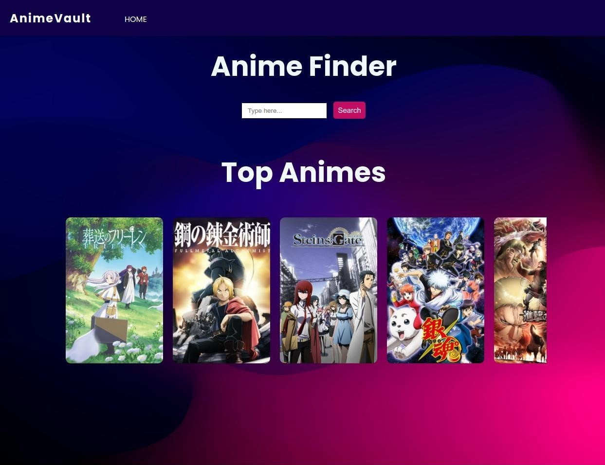
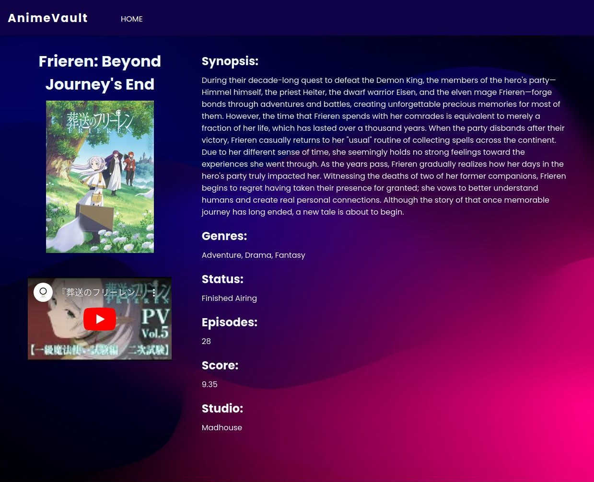

# AnimeVault

AnimeVault is a web application that allows users to explore detailed information about specific anime series.
It leverages the Jikan API to fetch anime data dynamically.


*Screenshot of AnimeVault home page*


*Screenshot of AnimeVault details page*

Explore AnimeVault live at [https://animevault-8wxe.onrender.com/](https://animevault-8wxe.onrender.com/).

## Features

- **Top Anime Listing**: View a curated list of top anime titles.
- **Search**: Search for specific anime titles and get detailed information.
- **Responsive Design**: Optimized for various screen sizes and devices.

## Technologies Used

- **Frontend**: HTML, CSS, JavaScript (ES6+)
- **Backend**: Node.js, Express.js
- **API**: Jikan API (Unofficial MyAnimeList API)
- **Dependencies**: Axios, Body-parser

## Prerequisites

Before you begin, ensure you have the following installed on your machine:

- Node.js - Download and install Node.js from the [official website](https://nodejs.org/). Ensure npm     (NodePackage Manager) is also installed along with Node.js.

## Getting Started

To run AnimeVault locally, follow these steps:

1. **Clone the repository**:

   ```bash
   git clone https://github.com/your-username/animevault.git
   cd animevault

2. **install dependencies**:

   ```bash
   npm install

3. **start the server**:

   ```bash
   node index.js

4. **open your browser**:

   Visit http://localhost:3000 to see AnimeVault in action!

## Contributing

Contributions are welcome! Feel free to fork the repository and submit pull requests to propose changes.

## Acknowledgments

- **Jikan API**: For providing the anime data used in this project.